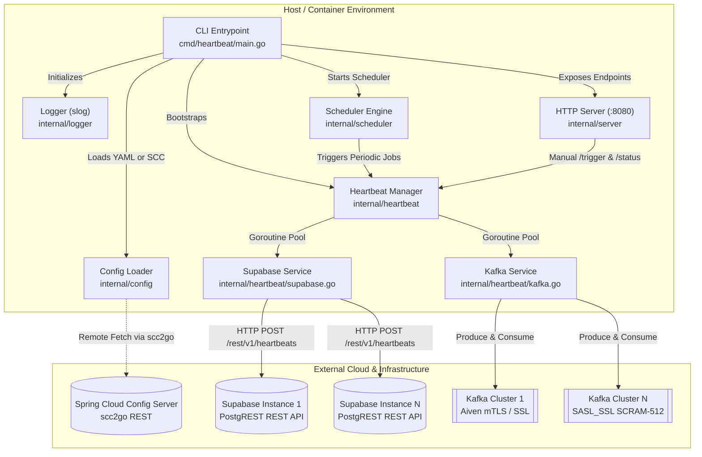
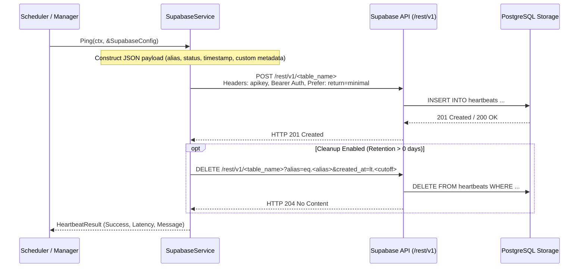
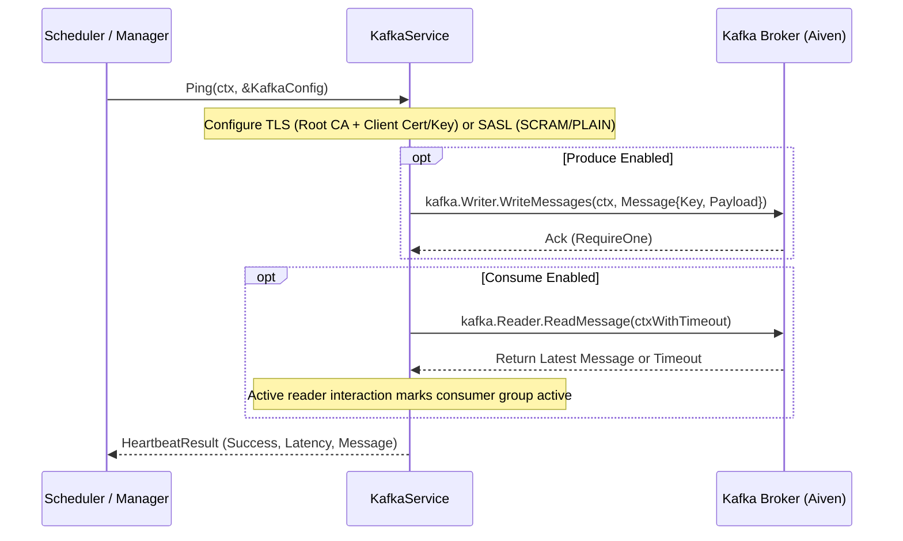

# Technical Architecture

## 1. System Overview & Component Diagram

HeartBeat is designed as a standalone, lightweight, cloud-agnostic daemon in Go that continuously or periodically exercises cloud data infrastructure (Supabase PostgreSQL via PostgREST and Aiven/Apache Kafka clusters) to prevent inactivity-based suspension, auto-pausing, or cold shutdowns.

---

## 2. Request & Execution Flow

### 2.1 Daemon Lifecycle
1. **Bootstrap**: `main.go` parses flags (`-config`, `-once`, `-version`, `-scc-url`, `-scc-auth`, `-scc-insecure`) and loads configuration either remotely from Spring Cloud Config via `scc2go` or locally from `config.yaml` with environment variable resolution (`${VAR:-default}`).
2. **Initialization**: Configures global structured logger (`slog`), instantiates `heartbeat.Manager`, and builds per-target execution specifications.
3. **Execution Routing**:
   - If `--once` is set: Invokes `Manager.RunAll(ctx)`, outputs execution results, and exits with code 0 (success) or 1 (failures detected).
   - If daemon mode: Starts `robfig/cron/v3` scheduler, optional HTTP server on port 8080, and registers OS signal listener (`os.Interrupt`, `syscall.SIGTERM`).
4. **Shutdown**: Upon receiving interrupt signals, the scheduler is drained, HTTP server shuts down with 5-second context timeout, and connections are closed gracefully.

### 2.2 Supabase Heartbeat Sequence

### 2.3 Kafka Heartbeat Sequence (Aiven Keep-Alive)

---

## 3. Concurrency & Resource Management

- **Goroutine Fan-out & Fan-in**:
  `Manager.RunAll` spawns dedicated goroutines for each configured Supabase database and Kafka cluster, using a `sync.WaitGroup` to await completion and a mutex-protected slice to gather results.
- **Thread-Safe State Caching**:
  `Manager` maintains a `sync.RWMutex` guarding `lastResults map[string]*HeartbeatResult` and `lastRun time.Time`, ensuring safe concurrent reads by the `/status` HTTP endpoint during active heartbeat sweeps.
- **Context Timeouts & Deadlines**:
  - Supabase HTTP operations utilize `context.WithTimeout` (default 15s or configurable via `timeout`).
  - Kafka consumer interactions run within a scoped context deadline (default 8s or configurable via `consume.timeout`), preventing blocking when no new messages arrive on the topic.
- **Pure Go Kafka Engine**:
  Utilizes `segmentio/kafka-go`, eliminating CGO and dynamic linking to `librdkafka`, allowing minimal Alpine/scratch container distribution.

---

## 4. Error Handling & Fault Tolerance

- **Isolated Failure Domains**: Failure of a single Supabase instance or Kafka cluster does not halt or fail sibling checks during a round.
- **Structured Error Return**: Every check produces a unified `HeartbeatResult` struct capturing success status, latency, error messages, and timestamps.
- **Multi-Status HTTP Reporting**: When one or more targets fail, `/status` responds with HTTP 207 (Multi-Status), enabling external monitors to identify partial degradation.
- **Exit Code Propagation**: In `--once` mode, any failed target triggers an exit code of `1` so orchestrators (GitHub Actions, Kubernetes CronJobs) immediately detect failures.

---

## 5. Observability & Telemetry

- **Structured Logging (`log/slog`)**: Standard library structured logger emitting either human-readable colored text or production-grade JSON logs (`app.log_format: "json"`).
- **HTTP Health Endpoints**:
  - `GET /healthz` & `GET /livez`: Fast 200 OK liveness probes.
  - `GET /status`: Detailed JSON payload with per-target latency, timestamps, and messages.
  - `POST /trigger`: On-demand manual trigger supporting synchronous (`?sync=true`) and asynchronous execution.

---

## 6. Data & Domain Boundaries

- **Keep-Alive Payloads**: Ephemeral records consisting of `id` (UUID), `alias` (string), `source` (string), `status` ("alive"), `created_at` (TIMESTAMPTZ), and optional arbitrary key-value metadata.
- **Storage Conservation**: Retention purges prevent infinite table growth in target databases without requiring database triggers or manual vacuuming.
